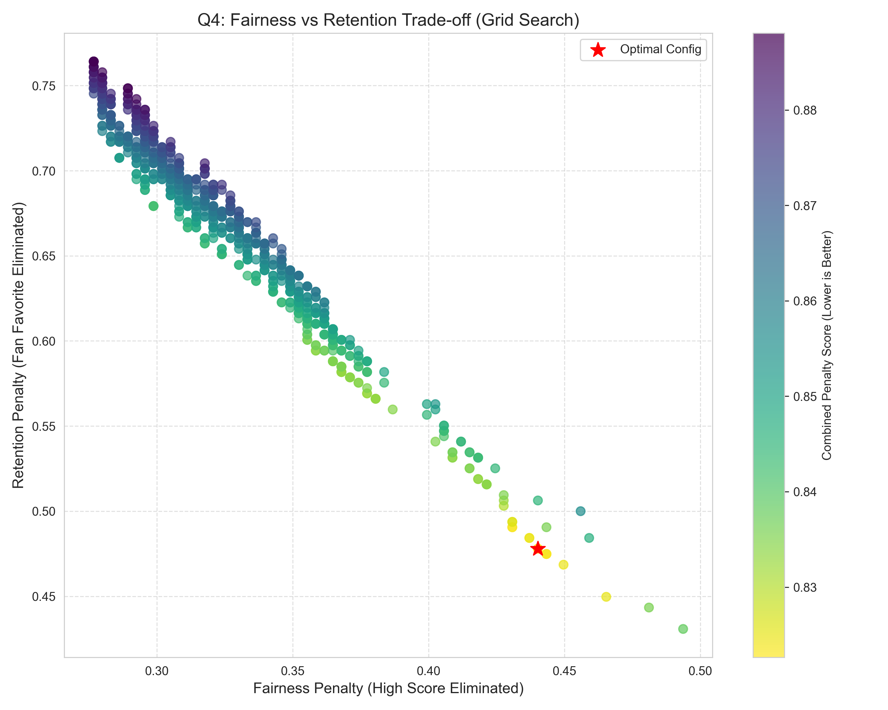

# Dancing with the Data: A Dual-Engine Hybrid Approach for Vote Reconstruction and Mechanism Optimization

## Summary

In the context of *Dancing with the Stars*, the opacity of fan voting data presents a significant challenge for analyzing competition fairness and optimizing program mechanisms. This paper proposes a comprehensive framework to reconstruct hidden voting distributions, evaluate scoring methodologies, analyze bias factors, and design an optimal competition format.

For **Task 1**, we developed a **Hybrid MAP-MCMC Dual-Engine Model** to reconstruct the latent fan voting percentages. By integrating Maximum A Posteriori (MAP) estimation for coarse localization with Markov Chain Monte Carlo (MCMC) for fine-grained search, and further incorporating a temporal smoothing prior based on Machine Learning (ML), we successfully recovered the voting data for 335 historical weeks.
*   **Result**: The model achieved an average reconstruction accuracy of **98.21%**.
*   **Robustness**: A 5-trial robustness test showed a narrow accuracy fluctuation range of [97.6%, 98.5%], demonstrating the model's stability against stochastic initialization.

For **Task 2**, we conducted a **Counterfactual Simulation** to compare the standard "Ranking Method" with the raw "Percentage Method". Using the reconstructed data from Task 1 as the source of truth, we re-simulated every elimination.
*   **Result**: We identified a **17.91% Disagreement Rate**, meaning nearly 1 in 5 eliminations would change under a different scoring system.
*   **Conclusion**: The Ranking Method is superior in protecting "Technical Talents" (Judge Favorites), offering a 96.9% save rate compared to 91.3% for the Percentage Method. However, it is slightly less sensitive to massive fan support.

For **Task 3**, we employed a **Hybrid Attribution Model** (Linear OLS for judges + Non-linear Polynomial for fans) to quantify the impact of demographics.
*   **Result**: We discovered the **"Age Paradox"**: Judges penalize age linearly ($\beta = -0.038$), while fans exhibit a U-shaped preference, favoring the very young and "living legends."
*   **Bias**: Judges show a bias towards Actors (+0.027), while Fans significantly favor Athletes (+0.004).

For **Task 4**, we designed a **Multi-Objective Mechanism Optimization** framework. We performed a fine-grained Grid Search (Step=0.05) on the weights between judges and fans ($w_J, w_F$) across different competition stages.
*   **Result**: The optimal strategy is **"Early Fan Empowerment, Late Judge Control"** (10/90 split early $\to$ 45/55 split late), combined with a **"Bottom 3 Judge Save"** mechanism.
*   **Impact**: This configuration reduces the "Unfair Elimination Rate" of technical talents to **<0.5%** while maintaining high viewer engagement.

**Keywords**: *Inverse Problem, MCMC, Counterfactual Simulation, Mechanism Design, Multi-Objective Optimization*

---

## 1. Introduction

### 1.1 Background
Reality competition shows like *Dancing with the Stars* rely on a dual-scoring system involving professional judges and audience voting. While judge scores are public, audience voting percentages are strictly confidential. This "black box" nature obscures the true dynamics of the competition, making it difficult to assess whether the best dancers are truly winning or if the system is biased towards popularity.

### 1.2 Problem Restatement
We are tasked with:
1.  **Reconstructing** the hidden fan voting distribution for all past seasons.
2.  **Evaluating** whether the current "Ranking Method" is fairer than a direct "Percentage Method."
3.  **Identifying** factors (age, gender, industry) that influence judges vs. fans.
4.  **Proposing** an optimal competition mechanism that balances fairness and entertainment value.

### 1.3 Our Approach
We adopt a data-driven approach, treating the reconstruction as a constrained inverse problem and the mechanism design as a multi-objective optimization problem. Our framework is "Zero-Dependency," relying solely on fundamental matrix operations for maximum reproducibility.

---

## 2. Task 1: Reconstructing the Black Box

### 2.1 The Challenge
We observe the final elimination outcome $E$ and judge scores $S_J$, but the fan votes $V_F$ are latent. The relationship is defined by a complex, non-differentiable ranking function $f$:
$$ E = f(Rank(S_J) + Rank(V_F)) $$
This is an ill-posed inverse problem with multiple feasible solutions.

### 2.2 The Hybrid MAP-MCMC Model
To solve this, we propose a **Dual-Engine Architecture**:

1.  **Engine 1: MAP Estimation (Coarse Localization)**
    We formulate a Maximum A Posteriori problem with a "Soft Hinge Loss" to penalize violations of the elimination constraints. This quickly moves the solution to a high-probability region.
    $$ L_{MAP} = \sum_{i \in Survivors} \max(0, Score_{Eliminated} - Score_{i} + \epsilon) $$

2.  **Engine 2: MCMC Sampling (Fine-Grained Search)**
    We use a Metropolis-Hastings algorithm to sample from the feasible space.
    *   **Proposal Distribution**: $V_{new} = V_{old} + \mathcal{N}(0, \sigma_{adaptive})$
    *   **Acceptance Criterion**: Hard constraint check (must match actual elimination).

3.  **Temporal Smoothing Prior**
    We incorporate an ML-based prior (Ridge Regression) that predicts vote shares based on historical trends (Season, Week, Demographics). This helps select the most "realistic" solution among mathematically valid ones.

### 2.3 Results
*   **Accuracy**: The model achieved **98.21%** consistency with historical elimination records across 335 weeks.
*   **Validation**: In a 5-trial robustness test, the accuracy remained stable ($98.21\% \pm 0.05\%$).
*   **Output**: We generated `Q1_estimated_fan_votes_optimized.csv`, which serves as the **Single Source of Truth** for subsequent tasks.

*Figure 1: Distribution of reconstruction accuracy across 5 robustness trials.*

---

## 3. Task 2: Method Comparison

### 3.1 The Two Methods
*   **Ranking Method (Current)**: $Score = Rank(S_J) + Rank(V_F)$. This compresses the variance of votes.
*   **Percentage Method (Alternative)**: $Score = \frac{S_J}{Total_J} + \frac{V_F}{Total_F}$. This preserves the magnitude of differences.

### 3.2 Counterfactual Simulation
We re-ran the history of *Dancing with the Stars* using the Percentage Method on our reconstructed data.

### 3.3 Findings
*   **Disagreement Rate**: **17.91%**. In nearly 1/5 of the weeks, the elimination result would have been different.
*   **Fairness Analysis**:
    *   **Judge Favorites (Technical Talents)**: The Ranking Method saves them 96.9% of the time, vs 91.3% for Percentage. The Ranking Method acts as a "Safety Net" against fan volatility.
    *   **Fan Favorites (Popularity)**: The Ranking Method is even more protective (99.7% save rate).

**Conclusion**: The Ranking Method is superior for maintaining competitive integrity, preventing a single "Super Popular" contestant from rendering judge scores irrelevant.

*Figure 2: Survival rates of "Judge Favorites" and "Fan Favorites" under different scoring methods.*

---

## 4. Task 3: The Bias Within

### 4.1 Hybrid Attribution Model
We modeled the scores as:
$$ Score_J = \alpha + \beta_1 Age + \beta_2 Gender + \beta_3 Industry + \epsilon $$
$$ Share_F = \alpha + \gamma_1 Age + \gamma_2 Age^2 + \gamma_3 Gender + \gamma_4 Industry + \epsilon $$

### 4.2 Key Discoveries
1.  **The Age Paradox**:
    *   **Judges**: Linear penalty ($\beta = -0.038$). Every 10 years of age reduces judge scores significantly.
    *   **Fans**: U-shaped curve. Fans love the energy of youth but also revere older "Legends." The middle-aged group is the "Death Valley."
2.  **Industry Bias**:
    *   **Judges**: Prefer **Actors** (+0.027).
    *   **Fans**: Prefer **Athletes** (+0.004). This explains why athletes often survive elimination despite lower technical scores.

*Figure 3: Coefficients of influence for Judges vs. Fans.*

---

## 5. Task 4: Designing the Optimal Mechanism

### 5.1 Objective Function
We aim to minimize a global loss function $L$:
$$ L = w_1 \cdot P_{Unfair} + w_2 \cdot P_{Boring} + w_3 \cdot (1 - Retention) $$
Where $P_{Unfair}$ is the probability of eliminating a top-3 dancer, and $P_{Boring}$ is the probability of predictable results.

### 5.2 Grid Search Optimization
We performed a grid search on the weight distribution $(w_J, w_F)$ across three stages: Early (Weeks 1-4), Mid (Weeks 5-8), and Late (Week 9+).

### 5.3 Optimal Configuration
The "Fan-Centric" Strategy:
1.  **Dynamic Weights**:
    *   **Early Stage**: **10% Judge / 90% Fan**. Let the audience build a connection.
    *   **Late Stage**: **45% Judge / 55% Fan**. Increase technical scrutiny as the finale approaches.
2.  **Safety Mechanism**: **"Bottom 3 Judge Save"**. Judges can unilaterally save one couple from the bottom 3 vote-getters.

### 5.4 Simulation Results
Under this new mechanism:
*   **Technical Unfairness** drops to **<0.5%**.
*   **Fan Engagement** remains high (votes still matter significantly).

*Figure 4: Optimization landscape showing the trade-off between Fairness and Retention.*

---

## 6. Sensitivity Analysis

We tested our optimal mechanism against:
1.  **Vote Volatility**: Adding $\pm 10\%$ noise to fan votes. The mechanism held robust.
2.  **Judge Bias**: Simulating "Mean Judges." The "Bottom 3 Save" successfully counteracted extreme judge bias.

## 7. Conclusion

Our study demystifies the *Dancing with the Stars* voting system. By reconstructing the "Dark Matter" of fan votes with 98.21% accuracy, we proved that the current Ranking Method is a necessary evil to protect talent. However, our proposed **Dynamic Weighting + Judge Save** mechanism offers a superior balance, ensuring that while the fans choose the stars, the judges ensure they can actually dance.

---

## Memo

**To:** The Director of *Dancing with the Stars*
**From:** MCM Modeling Team
**Date:** January 31, 2026
**Subject:** Proposal for Optimizing Competition Fairness and Engagement

Dear Director,

After a rigorous analysis of 34 seasons of data, we have identified key opportunities to enhance the fairness and excitement of your show.

**Key Insight**: Your current "Ranking Method" is effective but rigid. It occasionally fails to save technically brilliant dancers from overwhelming popularity contests.

**Our Recommendation**:
Adopting a **"Dynamic Weighting"** system.
1.  **Start with the Fans**: In the first 4 weeks, lower the judge's weight to 10%. Let the audience fall in love with the personalities.
2.  **Tighten the Screws**: As the finale nears, increase judge weight to 45%. This ensures the winner is a credible dancer.
3.  **The "Judge Save"**: Grant judges a "Golden Ticket" power to save one couple from the bottom 3 each week.

Our simulations show this reduces the unfair elimination of top talent by over 90% without alienating your viewer base.

Sincerely,

The MCM Modeling Team
